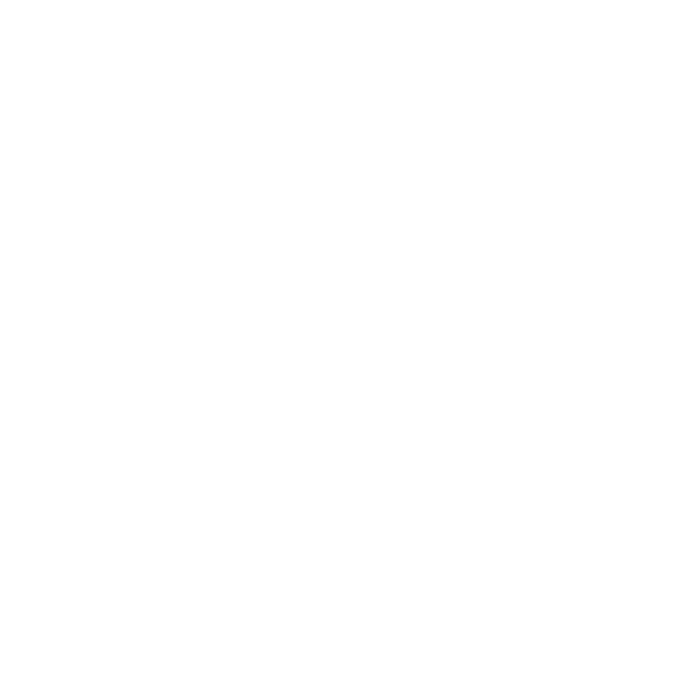
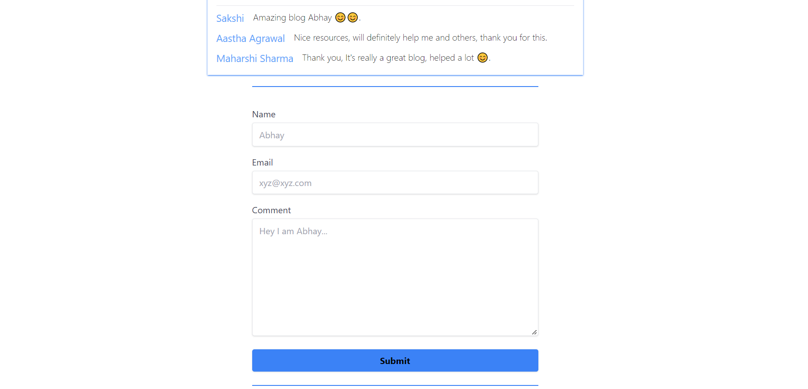
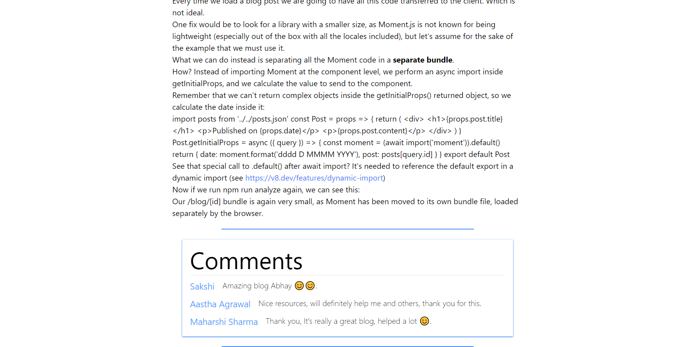
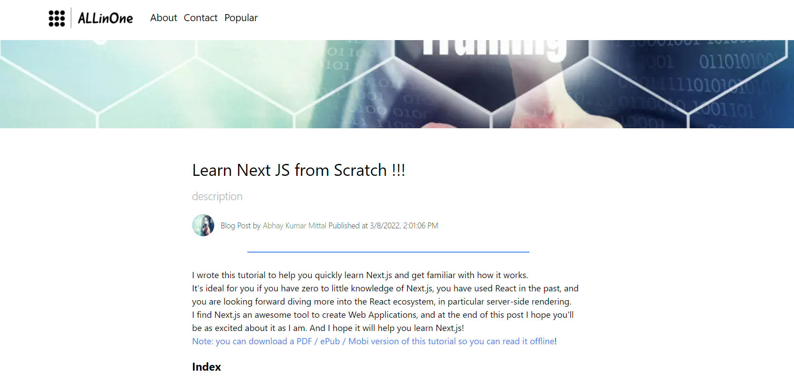

<div id="top"></div>
<!-- PROJECT LOGO -->
<br />
<div align="center">
  <a href="https://all-in-one-mitabhay.vercel.app/" target="_blank">
    
  </a>

  <h2 align="center">ALLinOne</h2>

  <p align="center">
    My Blogging Website
    <br />
    <br />
    <a href="https://github.com/MitAbhay/ALLinOne/issues target="_blank">Report Bug</a>
    ·
    <a href="https://github.com/MitAbhay/ALLinOne/issues target="_blank">Request Feature</a>
  </p>
</div>
<!-- ABOUT THE PROJECT -->

## About The Project

<div align="center">




</div>

This is my Blogging Website , which I named as ALLinOne becuase this is the place where I upload blogs and articles related to all technical and social domains. You can view any of the blog according to your intrest freely and can make best out of it for yourself, you can also comment or leave a message on by blogs, which on approval by me, will be shown to everyone.

I have used various technolgies to make application best for the user, I have tried my best to make this webssite user-friendly.
And I am trying to making it more user-friendly and attractive so the user can make best out of it.
This Application is still in development mode, and I am planning to make it public blog website where everyone can post their blogs and can manage their personal profile.

## What Tech Stack I have Used and Why?

- NextJs : I have created the Frontend part this website using NextJs Framework, and realy its the best Frontend Framework I have ever used. I have used powerfull Features of the NextJs that is ServersideRendering and StaticSiteGeneation to make this web application.

- TypeScript : I have used Typescript in this Application, because it makes the js develepment easier for us when we are dealing with large codes. It helps us to maintain the type of each and every thing easily.

- Sanity CMS : The backend of this web Application is intiated by sanity, it gives us the prebuilt schemas and all which makes our development faster, its fast and easy to use.

<p align="right">(<a href="#top">back to top</a>)</p>

<!-- CONTRIBUTING -->

# CONTRIBUTION TO THIS PROJECT

You can also Contribute to this project to make it more better and user friendly.

## Prerequisites

You need NodeJs installed in your system to run this project

- To check
  ```sh
  node -v
  ```

## Installation

Follow the following points to run this in your system

1.  Fork the repo
2.  Clone the repo
    ```sh
    git clone https://github.com/your_username_/Project-Name.git
    ```
3.  Enter in the project directory
    ```sh
    cd Project-Name
    ```
4.  Run it
    ```sh
    npm run dev
    ```

## Cuntribution Steps

Contributions are what make the open source community such an amazing place to learn, inspire, and create. Any contributions you make are **greatly appreciated**.
If you have a suggestion that would make this better, please fork the repo and create a pull request. You can also simply open an issue with the tag "enhancement".
Don't forget to give the project a star! Thanks again!

1. Fork the Project
2. Create your Feature Branch (`git checkout -b feature/AmazingFeature`)
3. Commit your Changes (`git commit -m 'Add some AmazingFeature'`)
4. Push to the Branch (`git push origin feature/AmazingFeature`)
5. Open a Pull Request

<!-- CONTACT -->

# Contact Me

- Abhay Kumar Mittal - [LinkedIn](https://www.linkedin.com/in/mitabhay/)
